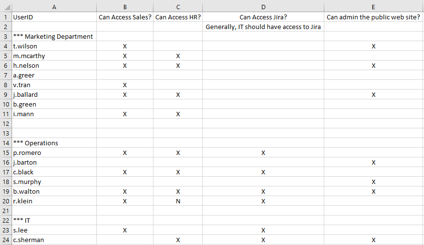

# Refactoring Exercise

The goal of the exercise is to take a poorly written piece of code and refactor it into something cleaner and more functional.  When refactoring it is sometimes hard to know when you are finished.  But for this exercise, we have these specific goals:

1. No nested control structures - actually, no control structures at all
2. Small pure functions
3. No null checking

We suggest the following steps when undertaking a refactoring of this type:

1. Traditional refactoring is first...
   - Make smaller functions - your IDE's "Extract Method" refactoring can be very helpful here.  Good method candidates are the code blocks inside a loop or an if statement.  Start with the inner most block and work your way out.
   - If there are any magic values, make functions with descriptive names
2. Make pure functions
3. Look for loops that could be turned into declarative Stream based functions
4. Refine, refine, refine

## Overview of the Exercise

This exercise grew out of a real world task at a client.  We were migrating applications to a new system.  The new system had a different authorization structure than the old system.  The new system has a very simple authorization schema...there is a table `ApplicationPermission` that has rows containing user ids and application numbers.  If a row exists, then the user has permission.  For example, if we want user `j.doe` to have access to application `36`, then we write an SQL statement like this:

```sql
insert into ApplicationPermission(user_id, application_id) values('j.doe', 36)
``` 

Our product owner created a spreadsheet containing information about which user should have access to which application. To migrate the applications, we need to read the spreadsheet and generate an SQL script for inserting authorizations into our new system. The spreadsheet looks like this:



As you can see, the spreadsheet isn't completely consistent.  However, we did notice the following:

1. If the first column of a row contains a String with a "." in the second position, then it is a row with user information
2. If columns B - E contain an "X", then the user should have access to the application. I don't know what's going on with column F :)

We also know the column to application mappings:

| Column | Application ID|
|--------|---------------|
| B | 2237 |
| C | 4352 |
| D | 3657 |
| E | 5565 |

Armed with this information, we can write a program to generate a script from the spreadsheet.  We're going to use [Apache POI](http://poi.apache.org/) to read the spreadsheet.  It's not important that you know how POI works for this exercise.

Unfortunately, in our haste to get this finished, we wrote a horrible horrible piece of code.  You can see the horrible code in `src/main/java/exercises/refactoring/AwfulScriptGenerator`. Now it's time to clean it up...
 
## Exercises

You can start this exercise with either step 1 or step 2.  We've supplied step 1 (the traditional refactoring) already.  This was accomplished solely with Eclipse's "extract method" refactoring and the addition of two utility methods to make the magic numbers clearer. We did this first step for you because it might have taken some time to understand what was going on in the original code and figure out good method names.  But if you want to start with doing this yourself, then feel free to do so.

If you get stuck along the way, the solutions for each step are in `src/main/java/solutions/refactoring`.

1. Traditional Refactoring (start with `src/main/java/exercises/refactoring/AwfulScriptGenerator`)

2. Make Pure Functions (start with `src/main/java/exercises/refactoring/AwfulScriptGeneratorRefactored`)

   - Change the `void addInsertStatementForCell(List, String, Cell)` method to `Optional<String> getInsertStatementForCell(String, Cell)`
   - Change the `void addInsertStatementsForRow(List, Row, String)` method to `List getInsertStatementsForRow(Row, String)` - For now use `Optional.ifPresent` to add the statement only if it exists
   - Change the `void addInsertStatementsForRow(List, Row)` method to `List getInsertStatementsForRow(Row)`

3. Look for Stream Opportunities

   - Look at the `List getInsertStatementsForRow(Row, String)` method. This method skips the first cell and then generates a line if there is an authority flag.  This can easily be turned into stream operation with `skip`, `filter` and `map`.  The new method should only be one line and should return `Stream<String>`. Note: 
      - You can use the `utilities.Utils.stream` method to stream the cells from the row.  Row is Iterable, but there is no built in JDK method to turn an Iterable into a Stream
      - You can use a construct like `.filter(Optional::isPresent).map(Optional::get)` to deal with the `Optional<String>` returned from `getInsertStatementForCell`.
   - Look at the `List getInsertStatementsForRow(Row)` method.  This method returns statements for a row if there is a valid user ID, or an empty list.  We'll work on making this cleaner in the following step, but for now change the method to return `Stream<String>` and return either the stream from the method changed above, or `Stream.empty()`
   - Look at the `List generate(Sheet)` generate method.  This method can be changed to stream the rows from the Sheet, flatten all the subsequent streams, and collect the result into a list to return.  Again, use the `utilities.Utils.stream` method to stream the rows from the sheet and the new method should only be one line long.

4. Refinement part 1 - remove a compound if statement.

   Look at the `Stream getInsertStatementsForRow(Row row)` method.  This method returns a stream of statements if the row has a valid user id.  A good change would be to not call the method at all if there isn't a valid user id.

   - Make a method `boolean hasValidUserId(Row)` return true if the first cell is not null and the value of the cell is a valid user id
   - Use this new method to filter out invalid rows in the `List generate(Sheet)` method
   - Now the `Stream getInsertStatementsForRow(Row)` method can be made simpler because we know it will only be called if there is a valid user id.

5. Refinement part 2 - use of Optional

   Notice that `boolean hasValidUserId(Row)` method is dealing with a null check.  Also notice that getting the first cell is repeated twice in the code - once to check if the user id is valid, and another time to retrieve the user id for the generated insert statement.
   
   - Make a method `Optional<Cell> getFirstCell(Row)` that returns the first cell wrapped in an optional (as it may be null).  This kind of method is useful for dealing with third party libraries (poi in this case) that will return nulls instead of optionals.
   - Make a method `Optional<String> getUserId(Row row)` that returns the value of the first cell if the cell isn't null.  This method should call `getFirstCell` and map the result using a method reference to the `getStringCellValue` method of `Cell`
   - Change the `hasValidUserId` method to use the new `getUserId` method.  We don't want this method to return an optional, so you will need to finish the call with the `orElse` method. 
   - You can also change the `Stream<String> getInsertStatementsForRow(Row)` method to call `getUserId`.  Even though that method returns an optional, we know there will always be a value in the optional because of the filter in the calling method.  So we can simply call the `get` method on the optional to get the value.

6. Refinement part 3 - function composition

   We are a little bothered by the switch statement, so we're going to fix that.  This step is a bit esoteric - we will use a method composition technique and make a Map of methods for the different values in the switch statement. You may or may not think this makes the code clearer.  We're doing it to demonstrate function composition in Java, but you'll have to decide for yourself if it is appropriate in your own code.
   - Delete the `getInsertStatement` function.  Make a `static BiFunction<String, Integer, Optional<String>> insertBuilder` member variable that does the same thing as the old `getInsertStatement` method except that it wraps the string in an Optional
   - Make a `static Map<Integer, Function<String, Optional<String>>> insertBuilderForCells` that will contain new functions for each of the different columns in a row
   - Use a static initializer to setup the Map.  For example, `insertBuilderForCells.put(1, userId -> insertBuilder.apply(userId, 2237));`
   - Change the `Optional<String> getInsertStatementForCell(String, Cell)` method to remove the switch statement and call the functions from the map.  You will need to check to see if the map contains a function for the row.  You can do this with a simple `if` statement, or you can wrap the returned value in an Optional and use `Optional.flatMap`, or you can use the `Map.getOrDefault` method to return a function that returns an empty Optional.  Each of these techniques is illustrated in the solution.
   
   As we said, this is a bit weird :)